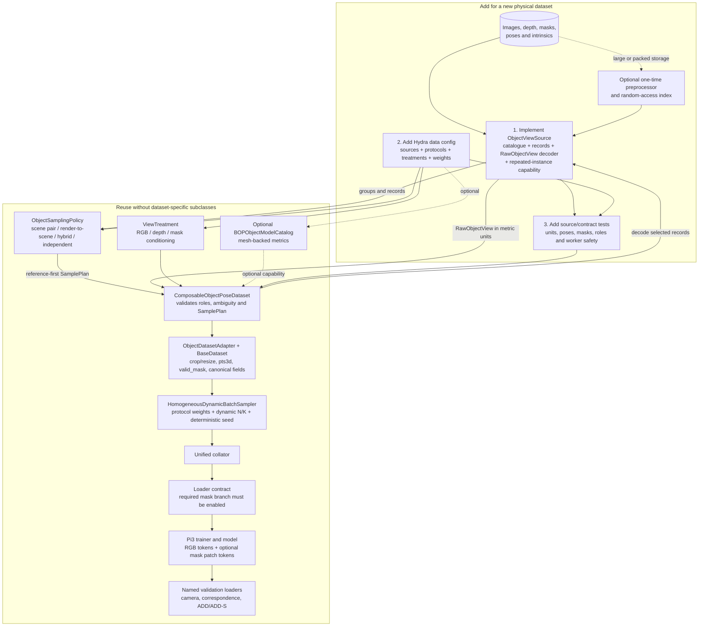

# Composable object-pose datasets

This layer separates four axes that must not be encoded as a subclass for every
combination:

1. physical storage and decoding (`ObjectViewSource`);
2. record topology (`ObjectSamplingPolicy`);
3. per-view input/supervision treatment (`ViewTreatment`);
4. weighted batch scheduling (the existing homogeneous mixture sampler).

It is additive. Existing `LMGeo*` and `MegaPoseGSOObjectDataset` Hydra targets
remain compatible. New object-pose datasets should normally use
`ComposableObjectPoseDataset` and implement only a source.

## Architecture and extension path



Solid arrows are required runtime paths; dashed arrows are optional. In the
usual case, adding a dataset means implementing one source, declaring one or
more protocol instances in Hydra, and testing the canonical contract. A new
policy is needed only for genuinely new sample topology, not for a new storage
format or a different masking choice.

## Canonical contract

Every source decodes one selected record into `RawObjectView`:

- RGB in its native resolution;
- depth in metres;
- an instance-specific object mask;
- OpenCV intrinsics;
- metric `T_C_O`, mapping CAD/object coordinates to camera coordinates;
- `camera_pose = inv(T_C_O) = T_O_C`.

Sources in one sample must use the same `object_namespace` and numeric object
ID. The orchestrator rejects a plan containing multiple object IDs or
namespaces. `BaseDataset` subsequently derives `pts3d` and `valid_mask` exactly
as for the legacy adapters.

The current sources are:

- `MegaPoseGSOSceneSource`: SQLite metadata plus direct byte-range reads from
  unextracted WebDataset tar shards;
- `IndexedBOPReferenceSource`: clean BOP-style object-reference folders through
  a compact immutable SQLite index;
- `BOPObjectModelCatalog`: optional, independently validated CAD-model
  availability.

The MegaPose catalogue scan is cached per process by source configuration.
Multiple protocol instances share immutable track metadata while keeping
SQLite and tar file descriptors process-local and safe for DataLoader workers.
If a source knows that an eligible scene can contain multiple tracks of the
same object ID, it must expose `contains_repeated_object_instances` and its
count. Construction then rejects any full-RGB role that neither isolates the
target in RGB nor provides an instance condition. This is a source capability,
not a MegaPose-specific check, so future object-pose stores inherit the same
fail-fast behavior.

## Treatments are orthogonal

`ViewTreatment` has three independent fields:

```yaml
rgb: full                 # full | object_only
depth: object_only        # full | object_only
mask_condition: object_if_repeated  # none | object | object_if_repeated
```

- `rgb=object_only` zeros pixels outside the object before conversion to model
  tensors.
- `depth=object_only` zeros depth outside the object, restricting Pi3 point
  supervision to the target.
- `mask_condition=object` supplies `[object mask, known=1]` to the optional
  model conditioning branch.
- `mask_condition=object_if_repeated` supplies that condition only when the
  record reports more than one same-object track/instance; otherwise it
  supplies `[0, known=0]`.
- `mask_condition=none` supplies `[0, known=0]`.
- The GT `object_visibility_mask` is retained in every mode.

The source's `mask_type` chooses whether the canonical object mask is BOP
`mask` or `mask_visib`. RGB treatment, depth treatment, and model conditioning
never imply one another.

Treatments can be defaults by role and can be overridden by role and source.
This is important for hybrid samples: clean renders can be unconditioned while
scene references remain mask-conditioned.

The two-channel condition is patch-embedded and added to RGB tokens. A
view-level known gate makes `[0,0]` an exact no-op, including after the
projection bias has trained. If any instantiated protocol can produce a known
condition, `create_dataloader` requires
`model.use_visibility_mask_conditioning=true`; pairing the data profile with a
model that would silently ignore the masks is an initialization error.

For the current fine-tuning baseline, the main decoder and heads use `5e-6`,
while the zero-initialized mask projection uses `5e-5`; its additive alpha is
fixed at `1.0`. This is the previously tested LMGeo mask-conditioning setup.

## Sampling policies

Policies consume source groups and return a declarative `SamplePlan`:

- `ScenePairPolicy`: references from one physical same-object track and queries
  from another, normally in a different scene;
- `RenderToScenePolicy`: clean reference views plus scene-track queries;
- `HybridReferencePolicy`: explicit ranges of clean-render references,
  scene-track references, and scene queries in every sample;
- `IndependentScenesPolicy`: one record per distinct scene, retained for sparse
  data and diagnostics.

All policies support independent reference/query count ranges, selection
strategies, and repetition control. Selection strategies are:

- `random`: training selection without replacement;
- `uniform`: uniform positions in the source's stored order;
- `first`: deterministic prefix (a contiguous window for sequential banks);
- `contiguous`: random contiguous window;
- `coverage_uniform`: uniform positions after sorting by the preserved
  `coverage_view_id`.

`RenderToScenePolicy(enumerate_query_groups=true)` changes evaluation length
from one sample per object to one sample per eligible query track. It is meant
for exhaustive held-out validation: each object/scene track is queried once,
while its clean references retain the declared selection strategy.

For the ordered GSO render bank, use `coverage_uniform` for the primary
full-sphere pose-alignment evaluation. Use `first` or `contiguous` only when the
hypothesis explicitly concerns nearby sequential context; a narrow five-view
trajectory can underconstrain reference-only Sim(3) alignment.

## Why protocols are dataset instances

One logical component corresponds to one explicit training protocol. The same
class and files may be instantiated several times with different policies or
treatments:

```yaml
train_dataset:
  weights:
    ScenePairConditioned: 4
    ScenePairRGBMasked: 1
    RenderToScene: 4
    HybridReferences: 2
```

The homogeneous mixture sampler chooses the component before filling a batch.
Component and view count are synchronized across distributed ranks. This gives
stable schemas, meaningful per-protocol logging, independent supported frame
counts, and explicit mixture weights. A zero weight disables a component before
Hydra instantiates it, so unused stores consume no startup time or file handles.

Do not add random `mode` switching inside the dataset. A policy should combine
sources inside one sample only when that combination (for example, two render
plus three scene references) is the protocol being tested.

Every view carries both `dataset_domain` and `protocol_name`. Trainer batch
counters prefer `mixture_component`/`protocol_name`, so two instances of the
same physical dataset do not collapse into one TensorBoard curve.

CAD-backed metrics and pose-overlay visualizers additionally route on
`object_model_namespace`. This permits GSO and LM-O validation loaders in one
run without ever opening an object ID in the wrong model catalogue. New
datasets sharing numeric object IDs must declare a distinct namespace and give
each CAD consumer the matching `object_model_namespaces` list.

## MegaPose-GSO profile

`configs/data/megapose_gso_composable_mixed.yaml` provides:

- scene-pair, full RGB, reference and query mask conditioning;
- scene-pair, object-only RGB, no model mask conditioning;
- clean-render to scene, full RGB, both roles conditioned;
- hybrid clean-render plus scene references.

It also provides four held-out-object/held-out-scene validation loaders:

- render-to-scene with uniform coverage references (primary);
- scene-to-scene anchor pairs;
- render-to-scene with the first contiguous ordered reference views;
- hybrid render and scene references.

Paths have environment overrides:

```bash
export PI3_GSO_DATA_ROOT=/path/to/MegaPose-GSO-fixed
export PI3_GSO_ASSETS_ROOT=/path/to/MegaPose-GSO-assets
export PI3_GSO_REFERENCES_ROOT=/path/to/MegaPose-GSO-assets/renders
```

Compose the A40 production pairing without opening either dataset:

```bash
python scripts/train_pi3.py --cfg job \
  train=train_megapose_gso_composable_a40_40gb_336x252_dynamic \
  data=megapose_gso_composable_mixed
```

Disable or rebalance protocols with Hydra overrides, for example:

```bash
train_dataset.weights.GSOScenePairRGBMasked=0 \
train_dataset.weights.GSOHybridReferences=0 \
train_dataset.weights.GSORenderToScene=8
```

## Preparing the render index

Run this after rendering finishes:

```bash
python datasets/preprocess/render/object_reference_index.py \
  --bank-root /media/internal/nvme/dtrofimov/datasets/MegaPose-GSO-assets/renders \
  --namespace gso \
  --mapping-path /media/internal/nvme/dtrofimov/datasets/MegaPose-GSO-assets/gso_models.json \
  --required-object-ids-path /media/internal/nvme/dtrofimov/datasets/MegaPose-GSO-assets/models_eval/models_info.json \
  --verify-images sample \
  --verify-workers 8
```

The default output is `renders/pi3_index/references.sqlite`. The command is
atomic and rejects incomplete validated-model coverage unless
`--allow-incomplete` is explicitly supplied for development. The explicit
models-info input matters because the raw mapping can include rejected source
meshes. It checks the bank fingerprint, object mapping, contiguous view IDs,
manifest/BOP pose agreement, payload existence, image resolution, and selected
image decodes.

Use `--verify-images all` for a final exhaustive decode. The training source
never parses all manifests or preloads images; it queries the index and decodes
only selected views.

Rerun the normal scene preprocessor after updating this code:

```bash
python datasets/preprocess/megapose_gso.py \
  --data-root /path/to/MegaPose-GSO-fixed
```

On an already complete index this does not reread tar payloads. It materializes
track counts for the standard visibility threshold (0.1), visible-pixel
threshold (64), and all three depth-corruption policies. These tables avoid a
20-million-row eligibility scan in every training process. Other thresholds
remain valid and transparently use the general query.

## Functional smoke

The compact smoke is deliberately not a research model. It uses DINOv2-S,
56x42 inputs, one N=5/K=1 sample per batch, 14 optimizer steps, and one batch
from each named validation protocol. Run it before a long launch:

```bash
gso_smoke_name=megapose_gso_composable_smoke_$(date +%Y%m%d_%H%M%S)
PI3_CUDA_MEMORY_LIMIT_GIB=20 \
PYTORCH_CUDA_ALLOC_CONF=expandable_segments:True \
python -u scripts/train_pi3.py \
  train=train_megapose_gso_composable_smoke \
  data=megapose_gso_composable_mixed \
  name="$gso_smoke_name" \
  train.auto_resume=false \
  log.use_tensorboard=false \
  log.save_best=false \
  log.save_checkpoints=false
```

For local 70 GiB production use
`train=train_megapose_gso_composable_rtxpro6000_blackwell_70gb_336x252_dynamic`
with `data=megapose_gso_composable_mixed`. The train and validation memory
budgets remain inherited from the measured hardware profile. Both composable
production train profiles restore `ObjectPoseMetric` against the validated GSO
`models_eval` catalogue; the legacy mesh-free profiles remain unchanged.

The existing CITEc launcher recognizes the composable profile and preflights
both the model and reference indexes. A four-A40 production launch is:

```bash
PI3_CUDA_MEMORY_LIMIT_GIB=40 \
PI3_TRAIN_GPUS=4 \
PI3_TRAIN_CONFIG=train_megapose_gso_composable_a40_40gb_336x252_dynamic \
PI3_DATA_CONFIG=megapose_gso_composable_mixed \
PI3_DATA_ROOT=/vol/coro/dtrofimov/data/projects/gfm-6dof/datasets/MegaPose-GSO-fixed \
PI3_GSO_ASSETS_ROOT=/vol/coro/dtrofimov/data/projects/gfm-6dof/datasets/MegaPose-GSO-assets \
PI3_GSO_REFERENCES_ROOT=/vol/coro/dtrofimov/data/projects/gfm-6dof/datasets/MegaPose-GSO-assets/renders \
PI3_RUN_NAME=megapose_gso_composable_a40_$(date +%Y%m%d_%H%M%S) \
PI3_WALLTIME=4-00:00:00 \
PI3_CKPT_INTERVAL=5 \
PI3_MAX_CHECKPOINTS=5 \
scripts/slurm/submit_citec_lmgeo_518_a40_dynamic.sh train
```

Use the same variables with the launcher argument `smoke` first. The assets and
render roots must be on shared storage visible from compute nodes.

## Adding another dataset

Implement `ObjectViewSource`:

1. expose eligible object IDs;
2. expose lightweight physical groups for an object;
3. return deterministic records for a group;
4. decode a record to the canonical `RawObjectView` contract;
5. optionally reject unsafe planned views (for example an ambiguous repeated
   target without RGB masking or mask conditioning);
6. keep database/file handles lazy, process-local, and pickle-safe.

Then reuse the existing dataset, policies, treatments, sampler, collator,
metrics, and visualizers. A new source should not require a new sampler or model
input path.

## Validation checklist

- source/index object namespaces and IDs agree;
- every selected sample has one object ID and reference views precede queries;
- `camera_pose @ T_C_O` is identity within tolerance;
- depth and translations are metres;
- RGB/depth/condition treatments affect only their declared fields;
- repeated target instances are disambiguated or rejected;
- no frame repetition when disabled;
- each mixture batch contains exactly one protocol;
- component/view-count schedules replay across epochs and ranks;
- named validation loaders use the prepared validation object and scene split;
- one real GPU smoke completes several optimizer steps and every validation
  loader before a long run.
